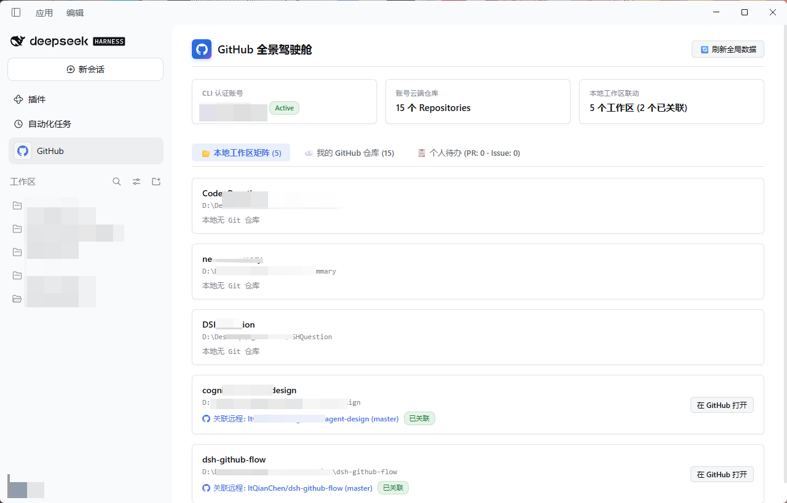
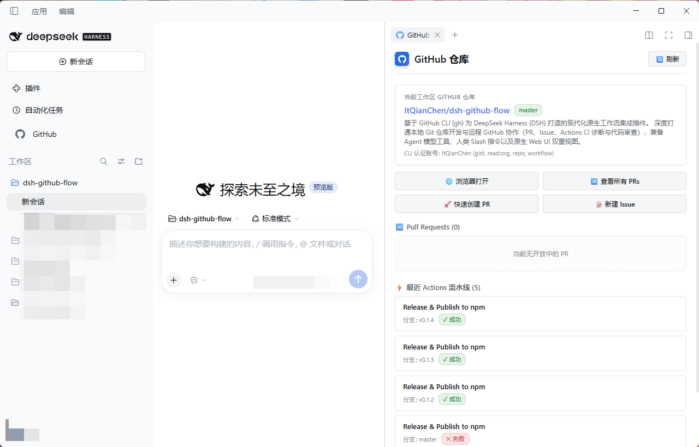

# DSH GitHub Flow (`dsh-github-flow`)

<p align="center">
  <a href="https://www.npmjs.com/package/dsh-github-flow"></a>
  <a href="https://www.npmjs.com/package/dsh-github-flow"></a>
  <a href="./LICENSE"></a>
  <a href="https://deepseek-harness.github.io/deepseek-harness/"></a>
</p>

<p align="center">
  <b>基于 GitHub CLI (<code>gh</code>) 为 DeepSeek Harness (DSH) 打造的现代化原生工作流集成插件。</b><br>
  深度打通本地 Git 仓库开发与远程 GitHub 协作（PR、Issue、Actions CI 诊断与代码审查），兼备 Agent 模型工具、人类 Slash 指令以及原生 Web UI 双重视图。
</p>

<p align="center">
  <b>简体中文</b> | <b><a href="./README.en.md">English</a></b>
</p>

---

## 🌟 核心特性

1. **零鉴权配置，开箱即用**：
   - 自动复用宿主机已通过 `gh auth login` 认证的登录凭据（OAuth Token / 系统 Keyring），无需在 DSH 中存储任何明文 GitHub PAT。
2. **工作区目录深度亲和与零参数探测 (CWD & Git Auto-Binding)**：
   - 自动绑定当前会话所在的物理工作区目录，原生直读本地 `.git/config` 并映射 `workspace.json`，无需 Agent 或人类手动传参 `owner/repo`，零参数直接识别关联仓库。
3. **高信噪比与 Token 防溢出治理**：
   - 拒绝 70+ 个碎片化微型工具撑爆上下文，收敛聚合为 **5 大领域核心 Tool**。
   - 所有查询原生采用 `--json <fields>` 按需返回；对 `diff`、`log_failed` 设置安全截断保护（默认 24KB），防止模型上下文窗口溢出崩溃。
   - 工具层已通过防御性输出包装，列表与标量 100% 契合 DSH 工具网关模式约束。
4. **原生 Web UI 双重视图与双模式自适应**：
   - **全局驾驶舱**（主导航栏 `sidebar.panellist`，Order 20）：透视账号全局仓库、本地工作区矩阵、个人待办 PR 与 Issues；
   - **右侧栏工作区面板**（`sidebarRightTabs`，Order 40）：常驻呈现当前仓库的 PR 状态、Checks 门禁药丸与 2x2 黄金快捷网格（浏览器打开、查看 PRs、快速创建 PR、新建 Issue），一键直达官方比对与创建页，零弹窗依赖；
   - **全场景双模式原生自适应**：深度契合 DSH 官方 DSW（DeepSeek Web）设计变量规范，通过 `body[data-ds-dark-theme]` 驱动浅色与深色主题实时零延迟平滑切换。
5. **符合 Cordis 官方微内核架构**：
   - 暴露原生 `GitHubService`（`ctx.github`），允许生态其他插件复用；
   - 具备符合 Standard Schema 规范的运行时配置校验（`Config`）；
   - 支持领域事件系统（`github/pr:create`, `github/issue:create`）。

---

## 📸 界面预览

### 全局全景驾驶舱 (Global Cockpit)
透视账号云端所有 GitHub 仓库、本地工作区矩阵联动状态，以及待办 PR 和 Issues：

<p align="center">
  
</p>

### 会话右侧栏工作区面板 (Session Workspace Panel)
自动绑定当前工程关联仓库，常驻呈现 PR 状态药丸、Actions 构建流水线与 2x2 黄金操作网格：

<p align="center">
  
</p>

---

## 🚀 安装指南

在 DSH 终端执行以下命令直接从 npm 安装：

```bash
# 安装到桌面端 Profile
dsh plugin --profile desktop add dsh-github-flow

# 或者安装到 Web Profile
dsh plugin --profile web add dsh-github-flow
```

---

## 🛠️ Agent 工具集速查

| 工具名称 | 核心操作 (`action`) | 典型场景 |
|---|---|---|
| `github_pr` | `list`, `view`, `create`, `diff`, `checks`, `review`, `merge` | 让 Agent 查看 PR 详情、检查 CI 状态、执行代码评审、合并 PR |
| `github_issue` | `list`, `view`, `create`, `comment`, `close`, `reopen` | 查看与搜索 Issue、创建 Issue、追加排查进展评论 |
| `github_run` | `list`, `view`, `log_failed`, `rerun`, `cancel` | 查看 CI 构建流水线，特别是 `log_failed` 可直接提取报错日志供 Agent 修复 |
| `github_repo` | `view`, `search_code`, `search_repos` | 查看仓库元数据、跨仓库代码搜索 |
| `github_api` | 任意端点（如 `repos/{owner}/{repo}/releases`） | 底层直接调用 REST / GraphQL API（支持 `--jq` 预过滤、`raw` 原始响应体模式） |

---

## 💬 人类 Slash 命令

在 DSH 对话输入框直接使用：
- `/gh status`：检查当前 GitHub CLI 账号登录状态、授权作用域与当前本地目录关联仓库；
- `/gh help`：查看使用帮助与常见语法示例。

---

## ⚙️ 插件配置项 (Config)

在 `cordis.patch.yml` 或 Profile 配置中自由覆盖如下字段：

```yaml
- insert:
    - id: github-flow
      name: dsh-github-flow
      config:
        ghPath: 'gh'              # GitHub CLI 程序路径（内网或特定环境可指定绝对路径）
        defaultTimeoutMs: 30000   # 命令执行超时时间（毫秒）
        maxOutputChars: 24000     # 单次命令最大返回字符数（防 Token 溢出保护）
        maxOutputBytes: 96000     # 单次命令最大返回字节数硬上限，默认 maxOutputChars × 4
        cacheTtlMs: 15000         # 界面概览数据缓存时间（毫秒）
        defaultListLimit: 20      # 默认查询列表返回条数
```

---

## 🔌 生态服务扩展 (Cordis Service)

其他 DSH 插件可通过依赖注入复用本插件的能力：

```ts
import type { Context } from '@deepseek-ai/cordis';

export const inject = ['github'];

export function apply(ctx: Context) {
  // 通过 ctx.github 直接调用底层安全执行引擎
  const auth = await ctx.github.checkAuth();
  const repo = await ctx.github.getRepoMetadata();
}
```

---

## 📚 开发与维护文档

- [npm 发布与版本维护指南](./docs/npm-publish-guide.md)
- [架构设计与技术规范](./docs/architecture.md)

---

## 📄 开源协议 (License)

本项目基于 [MIT License](./LICENSE) 协议开源。
